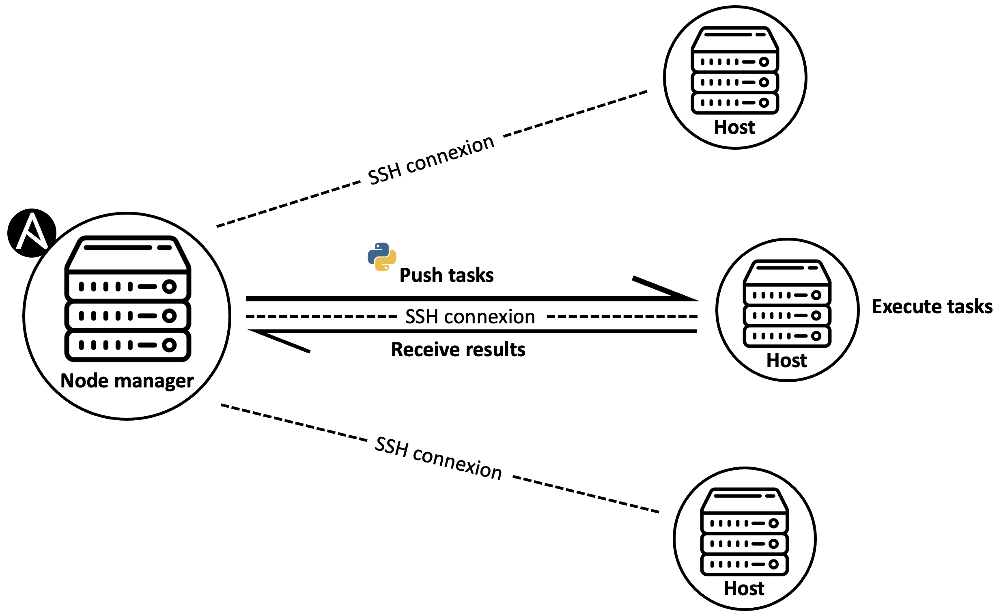

## Table of contents

- [Table of contents](#table-of-contents)
- [1. Introduction](#1-introduction)
- [2. Comment fonctionne Ansible](#2-comment-fonctionne-ansible)
- [3. Ansible Architecture Diagram](#3-ansible-architecture-diagram)
  - [3.1 Inventaire](#31-inventaire)
  - [3.2 Modules](#32-modules)
  - [3.3 La commande ansible](#33-la-commande-ansible)
  - [3.3 La commande ansible-playbook](#33-la-commande-ansible-playbook)


## 1. Introduction
Ansible est un outil d'automatisation informatique open source écrit en Python. Il peut configurer des systèmes, déployer des logiciels et orchestrer des tâches informatiques avancées, telles que des déploiements continus. Il a été créé en 2012 par Michael DeHaan, puis il a été racheté par Red Hat en 2015.
Red Hat a été racheté par IBM en 2018. Donc, Ansible appartient désormais à IBM. 
Le nom Ansible est tiré d’un roman de science-fiction écrit par Ursula Le Guin, et qui désigne un moyen de communication plus rapide que la lumière.



## 2. Comment fonctionne Ansible

Ansible fonctionne en mode push. Ce mode consiste à contrôler les serveurs (nodes) depuis un poste local qu’on appelle un node manager ou un control node.

Ansible est un outil **agentless**, c’est-à-dire qu’il n’installe pas d’agent sur les nodes. Il travaille donc en mode push : il pousse les installations sur les nodes. Pour cela, il n’utilise que les outils déjà présents sur la plupart des systèmes Linux : SSH et Python.

L’inverse du mode **push** est le mode **pull**. Par exemple, une marketplace d’applications comme le Play Store ou l’AppStore d’Apple sont des systèmes en mode pull : le client (le smartphone) tire les applications ou les mises à jour vers lui

Le node manager doit être ne machine **UNIX** disposant d’une version d’Ansible installée. Les nodes peuvent être des systèmes Centos, Windows, Ubuntu ou autre. Il n’y a pas de corrélation entre le système du node manager et le système des nodes. 

Une fois Ansible installé sur cette machine, les tâches à exécuter sont écrites dans des fichiers de configuration en yaml, ces tâches sont converties par Ansible vers des modules python, puis sont poussées grâce à une connexion SSH pour être exécutées sur les serveurs distants.

La connexion SSH est maintenue jusqu’à ce que les tâches soient totalement exécutées et que les résultats soient renvoyés vers le node manager.


Why Use Ansible?
- No Agent: As long as the box can be ssh’d and it has Python, it can be configured with Ansible
- Idempotent: Ansible’s whole architecture is structured around the concept of idempotency. The core idea here is that you only do things if they are needed and that things are repeatable without side effects.
- Declarative Not Procedural: Other configuration tools tend to be procedural do this and then do that and so on. Ansible works by you writing a description of the state of the machine that you want and then it takes steps to fulfill that description.
- Tiny Learning Curve: Ansible is quite easy to learn. It doesn’t require any extra knowledge.
    
Ansible Use Cases
- Provisioning
- Configuration Management
- App Deployment
- Continuous Delivery
- Security & Compliance
- Orchestration

## 3. Ansible Architecture Diagram


### 3.1 Inventaire

Avant de configurer les tâches, il est nécessaire de définir l’inventaire Ansible. Il s’agit de l’ensemble des serveurs qu’on souhaite gérer. L’inventaire peut contenir un ou plusieurs serveurs. On peut regrouper ces serveurs dans des sous-groupes pour en faciliter la gestion.

Le but de l’inventaire est de pouvoir cibler les serveurs pour lesquels les tâches Ansible seront exécutées, ainsi que de définir des variables pour chaque serveur.

Il est possible de définir les serveurs de trois manières :

un fichier INI statique,
un fichier YAML statique,
un script qui génère l’inventaire sous forme de JSON d’une manière dynamique.
Les deux premières méthodes statiques sont à privilégier quand on dispose de serveurs physiques. En revanche, le script dynamique est très recommandé pour lister les serveurs virtuels créés dans un cloud.

Dans l’exemple ci-dessus, l’inventaire contient 2 serveurs web et 1 un serveurs database. Les serveurs web appartiennent au groupe web, et les serveurs database appartiennent aux groupes db.

```ini
web_1 ansible_host=35.1.1.1
web_2 ansible_host=35.1.1.2
lb ansible_host=35.1.1.3
db ansible_host=35.1.1.4
[webs]
web_1
web_2
[dbs]
db
[lbs]
lb
```

### 3.2 Modules

Ansible fournit plus de 3000 modules qui permettent d’exécuter des tâches sur chaque serveur.
La commande ansible-doc -l liste l’ensemble de ces modules.
Ansible fournit aussi une documentation détaillée pour chaque module via la commande ansible-doc <module>.
Chaque module peut être exécuté sous forme d’une tâche. Cette dernière est définie par :
- sa configuration (un ensemble de paramètres qui ne dépendent pas du module), 
- le module Ansible choisi,
- la configuration du module (un ensemble d’arguments propre au module).
Les tâches peuvent être lancées grâce aux deux commandes suivantes : ansible et ansible-playbook. Nous les détaillons ci-après :

### 3.3 La commande ansible
C’est la commande qui permet de lancer une seule tâche en mode ad-hoc sur un ou plusieurs serveurs. Ce mode est principalement utilisé sur des environnements de développement pour faire des tests ou pour se familiariser avec des nouveaux modules.
On peut l’utiliser ponctuellement en production pour exécuter des tâches non répétitives.
La commande ad-hoc se lance de cette manière :

```bash
ansible <PATTERN> -i <INVENTORY> -m <MODULE_NAME> -a <MODULE_ARGS> -b
```

l’argument pattern permet de définir le nom du serveur ou le groupe de serveurs sur lesquels la tâche sera lancée.
En plus de cet argument principal, on trouve les arguments optionnels suivants :
- -i ou --inventory : le chemin vers le fichier de l’inventaire,
- -m ou --module-name : le nom du module Ansible,
- -a ou --args : l’ensemble des clés/valeurs pour paramétrer le module,
- -b ou --become: Certains modules nécessitent des droits pour être exécutés. Dans ce cas, ce paramètre doit être rajouté pour l’élévation des privilèges (sudo).

### 3.3 La commande ansible-playbook
Contrairement à la commande ad-hoc, ansible-playbook permet de lancer un ensemble de tâches codées dans un ou plusieurs fichiers yaml, et destinées à être exécutées de manière répétée en production.
Dans la suite de cet article, nous verrons en détail ce qu’est un playbook, les éléments qui le composent et comment ils sont structurés dans un projet.
Exemples
Le module debug
On commence les exemples par le module debug, un module très utile pour déboguer des variables et tester des conditions au milieu d’un playbook.

