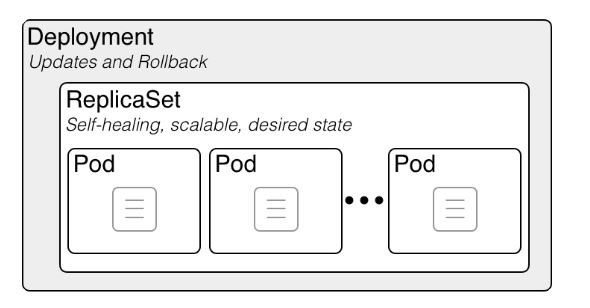

## Table of contents

- [Table of contents](#table-of-contents)
- [1. Introduction](#1-introduction)
- [2. L’écosystème Kubernetes](#2-lécosystème-kubernetes)
- [3. Architecture de Kubernetes](#3-architecture-de-kubernetes)
  - [3.1 Worker Node In K8s Cluster:](#31-worker-node-in-k8s-cluster)
  - [3.2 Master Node in K8s cluster:](#32-master-node-in-k8s-cluster)
- [4. Concepts de Kubernetes](#4-concepts-de-kubernetes)
- [4.1 Principes d’orchestration](#41-principes-dorchestration)
  - [4.1.1 Haute disponibilité](#411-haute-disponibilité)
  - [4.1.2 Répartition de charge (load balancing)](#412-répartition-de-charge-load-balancing)
  - [4.1.3 Healthchecks](#413-healthchecks)
  - [4.1.4 Découverte de service (service discovery)](#414-découverte-de-service-service-discovery)
  - [4.1.5 Les stratégies de déploiement](#415-les-stratégies-de-déploiement)
- [5. Objets Kubernetes](#5-objets-kubernetes)
  - [5.1 L’API et les Objets Kubernetes](#51-lapi-et-les-objets-kubernetes)
  - [5.2 La commande apply](#52-la-commande-apply)
  - [5.3 Syntaxe de base d’une description YAML Kubernetes](#53-syntaxe-de-base-dune-description-yaml-kubernetes)
  - [5.4 Objets de base](#54-objets-de-base)
    - [5.4.1 Les namespaces](#541-les-namespaces)
    - [5.4.2 Les Pods](#542-les-pods)
    - [5.4.3 Les ReplicaSet](#543-les-replicaset)
    - [5.4.4 Les Deployments](#544-les-deployments)
    - [5.4.5 Les Services](#545-les-services)
    - [5.4.5 Le stockage dans Kubernetes: StorageClasses](#545-le-stockage-dans-kubernetes-storageclasses)
    - [5.4.5 Le stockage dans Kubernetes: StatefulSets](#545-le-stockage-dans-kubernetes-statefulsets)
    - [5.4.5 Le stockage dans Kubernetes: DaemonSets](#545-le-stockage-dans-kubernetes-daemonsets)
    - [5.4.5 Le stockage dans Kubernetes: Les ConfigMaps](#545-le-stockage-dans-kubernetes-les-configmaps)
    - [5.4.5 Le stockage dans Kubernetes: les Secrets](#545-le-stockage-dans-kubernetes-les-secrets)
    - [5.4.5 Le stockage dans Kubernetes: Les CRD et Operators](#545-le-stockage-dans-kubernetes-les-crd-et-operators)
- [6. Le réseau dans Kubernetes](#6-le-réseau-dans-kubernetes)
  - [6.1 Les objets Services](#61-les-objets-services)
  - [6.2 Les network policies](#62-les-network-policies)
  - [6.3 Le loadbalancing](#63-le-loadbalancing)
  - [6.4 Les objets Ingresses](#64-les-objets-ingresses)
- [7. Helm, le gestionnaire de paquets Kubernetes](#7-helm-le-gestionnaire-de-paquets-kubernetes)

## 1. Introduction

Kubernetes, souvent abrégé en K8s, est un outil d'orchestration de conteneurs open source, initialement développé par Google. Il permet de gérer des applications conteneurisées, comme celles basées sur Docker, dans différents environnements de déploiement tels que des machines physiques, des machines virtuelles, le cloud ou des environnements hybrides. 

**Problèmes résolus par Kubernetes** :
Avec la transition des architectures monolithiques vers les microservices et l'usage accru des conteneurs, Kubernetes répond à la demande croissante d'une gestion efficace de centaines, voire de milliers de conteneurs. 

**Fonctionnalités clés de Kubernetes** :
- **Haute disponibilité** (hight availability) : garantit que les applications restent accessibles sans interruption.
- **Évolutivité** (Scalability or high performance) : permet d'ajuster rapidement la capacité de l'application en fonction de la demande.(scale your applications fast when you have more load on it ans more users are trying to access it and the same way you can easily scale it down when the load goes down)
- **Récupération** : assure des mécanismes de sauvegarde et de restauration des données en cas de problème infrastructurel.

## 2. L’écosystème Kubernetes

L'écosystème Kubernetes est constitué d'une variété de flavours qui implémentent les standards définis par Kubernetes, notamment pour les solutions réseau, le stockage, le loadbalancing, l'Ingress, l'autoscaling de clusters et le monitoring. Bien qu'il soit possible de créer un cluster Kubernetes personnalisé, cela demande une expertise technique et des choix complexes, ce qui pousse souvent les utilisateurs vers des solutions de fournisseurs de cloud, entraînant un vendor lock-in.

Voici quelques exemples d'écosystèmes Kubernetes populaires :
- **Google Kubernetes Engine (GKE)** : L’écosystème Kubernetes développé par Google. Très populaire car très flexible tout en étant l’implémentation de référence de Kubernetes.
- **Azure Kubernetes Services (AKS)** : Un écosystème Kubernetes axé sur l’intégration avec les services du cloud Azure (stockage, registry, réseau, monitoring, services de calcul, loadbalancing, bases de données…).
- **Elastic Kubernetes Services (EKS)** : Un écosystème Kubernetes assez standard à la sauce Amazon axé sur l’intégration avec le cloud Amazon (la gestion de l’accès, des loadbalancers ou du scaling notamment, le stockage avec Amazon EBS, etc.)
- **Rancher** : Un écosystème Kubernetes très complet, assez opinionated et entièrement open-source, non lié à un fournisseur de cloud. Inclut l’installation de stack de monitoring (Prometheus), de logging, de réseau mesh (Istio) via une interface web agréable. Rancher maintient aussi de nombreuses solutions open source, comme par exemple Longhorn pour le stockage distribué.
- **k3s** : Un écosystème Kubernetes fait par l’entreprise Rancher et axé sur la légèreté. Il remplace etcd par une base de données Postgres, utilise Traefik pour l’ingress et Klipper pour le loadbalancing.
- **Openshift** : Une version de Kubernetes configurée et optimisée par Red Hat pour être utilisée dans son écosystème. Tout est intégré donc plus guidé, avec l’inconvénient d’être un peu captif·ve de l’écosystème et des services vendus par Red Hat.
  


## 3. Architecture de Kubernetes

Kubernetes adopte une architecture **master/worker**, où un cluster Kubernetes est composé d'au moins un nœud maître (master node) et de plusieurs nœuds de travail (worker nodes), également appelés simplement "nœuds". Ces nœuds peuvent être des machines physiques ou virtuelles; vous interagirez rarement directement avec les nœuds.

- **Nœud maître** : il orchestre l'ensemble du cluster. Il gère la planification des applications, la distribution des ressources et assure la communication entre les nœuds de travail.
    Le “master” fait référence à un ensemble de processus gérant l’état du cluster. Le master peut également être répliqué pour la disponibilité et la redondance.
- **Nœuds de travail** : ce sont les machines sur lesquelles les conteneurs d'applications s'exécutent. Chaque nœud de travail est sous la supervision du nœud maître et héberge des pods qui contiennent les conteneurs.
  
Cette architecture permet une gestion flexible et évolutive des applications, avec une séparation claire des rôles entre la gestion du cluster (nœud maître) et l'exécution des tâches (nœuds de travail).


### 3.1 Worker Node In K8s Cluster:


En tant que développeur ou administrateur Kubernetes, vous interagirez principalement avec les nœuds de travail (worker nodes) pour déployer, mettre à jour ou autoscaler vos applications conteneurisées. Un nœud de travail exécute le travail réel du cluster et contient des pods, qui sont des abstractions de vos applications conteneurisées.

Chaque nœud de travail exécute trois processus clés :
1. **Container Runtime** : C'est l'environnement dans lequel les conteneurs sont exécutés. Exemples : containerd, CRI-O, Docker.
2. **kubelet** : Le kubelet est un agent principal qui s'exécute sur chaque nœud de travail. Il interagit à la fois avec le nœud et les conteneurs sur ce nœud. Il a plusieurs responsabilités clés :
   - **Gestion des Pods** : Il maintient un ensemble de pods (composés de un ou plusieurs conteneurs) sur le système local du nœud.
   - **Enregistrement et Rapport** : Il enregistre le nœud auprès du cluster Kubernetes, envoie des événements, des états des pods, et rapporte l'utilisation des ressources.
   - **Observation des PodSpecs** : Le kubelet surveille les PodSpecs (descriptions de pods en YAML ou JSON) via l'API Kubernetes et veille à ce que les conteneurs décrits dans ces PodSpecs soient en cours d'exécution et en bonne santé.
   - Lorsque Kubernetes veut planifer un pod, il envoie des PodSecs du pod au Kubelet. Le kubelet s’assure alors que les conteneurs sont sains et son conforme à la configuration déclarative.
3. **kube-proxy** : Kube proxy permet de mettre les nodes en réseau avec des règles qui assurent la communication entre les pods et et les entités extérieures au cluster.
  Kube-proxy peut fonctionner selon 3 modes : iptables, ipvs et userspace. Chaque mode est adapté en fonction de la taille du cluster.
    
Ces processus doivent être installés et fonctionnels sur chaque nœud de travail pour garantir une gestion efficace des applications conteneurisées. Cependant, la gestion des nœuds de travail et la planification des pods dépendent du nœud maître (Master Node).

### 3.2 Master Node in K8s cluster:


Le nœud maître, également connu sous le nom de plan de contrôle (control plane), est chargé de gérer efficacement les nœuds de travail (ou nœuds esclaves). Ses principales responsabilités incluent :
   - Planification des Pods : Décider sur quels nœuds de travail les pods doivent être déployés.
   - Surveillance des Nœuds et Pods : Observer l'état des nœuds de travail et des pods.
   - Démarrage et Redémarrage des Pods : Assurer que les pods sont lancés et redémarrés si nécessaire.
   - Gestion des Nouveaux Nœuds de Travail : Intégrer les nouveaux nœuds de travail dans le cluster.

Les nœuds maîtres dans un cluster Kubernetes exécutent les processus clés suivants :
   - **kube-apiserver** : Le point d'entrée principal pour toutes les communications avec le cluster, traitant les requêtes API et coordonnant les interactions entre les différents composants Kubernetes.
   - **kube-controller-manager** (kubectl): Gère les contrôleurs qui surveillent l'état du cluster et apportent les modifications nécessaires pour maintenir l'état désiré (par exemple, redémarrage des pods en cas de défaillance).
   - **kube-scheduler** : Assigne les pods aux nœuds de travail en fonction des ressources disponibles et des contraintes de planification.
   - **etcd** : La base de données distribuée qui stocke l'état actuel du cluster, y compris les configurations et les métadonnées des objets Kubernetes.


## 4. Concepts de Kubernetes
## 4.1 Principes d’orchestration
### 4.1.1 Haute disponibilité
- Faire en sorte qu’un service ait un “uptime” élevé.
- On veut que le service soit tout le temps accessible même lorsque certaines ressources manquent :
  - elles tombent en panne
  - elles sont sorties du service pour mise à jour, maintenance ou modification
- Pour cela on doit avoir des ressources multiples…
  - Plusieurs serveurs
  - Plusieurs versions des données
  - Plusieurs accès réseau
- Il faut que les ressources disponibles prennent automatiquement le relais des ressources indisponibles. Pour cela on utilise généralement:
  - des “load balancers” : aiguillages réseau intelligents
  - des “healthchecks” : une vérification de la santé des applications
- Mais aussi :
  - des réseaux de secours
  - des IP flottantes qui fonctionnent comme des load balancers
  - etc.
- Nous allons voir que Kubernetes intègre automatiquement les principes de load balancing et de healthcheck dans l’orchestration de conteneurs
### 4.1.2 Répartition de charge (load balancing)

{ width=40% }

- Un load balancer : une sorte d'“aiguillage” de trafic réseau, typiquement HTTP(S) ou TCP.
- Un aiguillage intelligent qui se renseigne sur plusieurs critères avant de choisir la direction.
- Cas d’usage :
  - Éviter la surcharge : les requêtes sont réparties sur différents backends pour éviter de les saturer.
- L’objectif est de permettre la haute disponibilité : on veut que notre service soit toujours disponible, même en période de panne/maintenance.
  - Donc on va dupliquer chaque partie de notre service et mettre les différentes instances derrière un load balancer.
  - Le load balancer va vérifier pour chaque backend s’il est disponible (healthcheck) avant de rediriger le trafic.
  - Répartition géographique : en fonction de la provenance des requêtes on va rediriger vers un datacenter adapté (+ proche).
- Solutions de load balancing externe
  - HAProxy : Le plus répandu en load balancing.
  - Traefik : Simple à configurer et se fond dans l’écosystème des conteneurs Docker et Kubernetes
  - NGINX : Serveur web central qui a depuis quelques années des fonctions puissantes de load balancing et TCP forwarding.
### 4.1.3 Healthchecks
Fournir à l’application une façon d’indiquer qu’elle est disponible, c’est-à-dire :
- qu’elle est démarrée (liveness)
- qu’elle peut répondre aux requêtes (readiness).


### 4.1.4 Découverte de service (service discovery)
Classiquement, les applications ne sont pas informées du contexte dans lequel elles tournent : la configuration doit être opérée de l’extérieur de l’application.
  - par exemple avec des fichiers de configuration fournie via des volumes
  - ou via des variables d’environnement
  
Mais dans un environnement hautement dynamique comme Kubernetes, la configuration externe ne suffit pas pour gérer des applications complexes distribuées qui doivent se déployer régulièrement, se parler et parler avec l’extérieur.
<u>La découverte de service désigne généralement les méthodes qui permettent à un programme de chercher autour de lui</u> (généralement sur le réseau ou dans l’environnement) ce dont il a besoin.
  - La mise en place d’un système de découverte de service permet de rendre les applications plus autonomes dans leur (auto)configuration.
  - Elles vont pouvoir récupérer des informations sur leur contexte (dev ou prod, Etats-Unis ou Europe ?)
  - Ce type d’automatisation permet de limiter la complexité du déploiement.
Concrètement, au sein d’un orchestrateur, un système de découverte de service est un serveur qui est au courant automatiquement :
  - de chaque conteneur lancé. 
  - du contexte dans lequel chaque conteneur a été lancé.
  
Ensuite il suffit aux applications de pouvoir interroger ce serveur pour s’autoconfigurer.
Un exemple historique de découverte de service est le DNS : on fait une requête vers un serveur spécial pour retrouver une adresse IP (on découvre le serveur dont on a besoin). Cependant le DNS n’a pas été pensé pour ça :
  - certaines application ne rafraichissent pas assez souvent leurs enregistrements DNS en cache
le DNS devient trop complexe à partir de quelques dizaines d’enregistrements

**Solutions de découverte de service**
- Consul (Hashicorp) : assez simple d’installation et fourni avec une sympathique interface web.
- etcd : a prouvé ses performances à plus grande échelle mais un peu plus complexe
### 4.1.5 Les stratégies de déploiement
SRC : https://blog.container-solutions.com/kubernetes-deployment-strategies

Il existe deux types de stratégies de rollout native à Kubernetes :
- Recreate : arrêter les pods avec l’ancienne version en même temps et créer les nouveaux simultanément
- RollingUpdate : mise à jour continue, arrêt des anciens pods les uns après les autres et création des nouveaux au fur et à mesure (paramétrable)

Mais il existe un panel de stratégies plus large pour updater ses apps :
- blue/green : publier une nouvelle version à côté de l’ancienne puis changer de trafic
- canary : diffuser une nouvelle version à un sous-ensemble d’utilisateurs, puis procéder à un déploiement complet
- A/B testing: diffusion d’une nouvelle version à un sous-ensemble d’utilisateurs de manière précise (en-têtes HTTP, cookie, région, etc.).
  - pas possible par défaut avec Kubernetes, implique une infrastructure plus avancée avec reverse proxy (Istio, Traefik, nginx/haproxy personnalisé, etc.).

## 5. Objets Kubernetes
### Introduction:

En Kubernetes, un **workload** fait référence à une application ou un ensemble de processus déployés dans un cluster. Kubernetes offre plusieurs types de workloads pour répondre à différents types d'applications et de besoins de gestion. Voici les principaux types de workloads Kubernetes :

1. **Pod**
- **Description** : Le **Pod** est l’unité de base de déploiement dans Kubernetes. Il représente un ou plusieurs conteneurs qui partagent le même réseau et espace de stockage. Généralement, un Pod contient un seul conteneur.
- **Usage** : Utilisé lorsque vous souhaitez exécuter une instance unique ou plusieurs conteneurs qui doivent cohabiter dans le même environnement réseau et de stockage.

1. **Deployment**
- **Description** : Le **Deployment** est le workload le plus courant pour les applications sans état (stateless). Il permet de gérer une réplique d’un ensemble de Pods de manière déclarative (scaling, mise à jour, rollback).
- **Usage** : Pour les applications web ou microservices sans état nécessitant une mise à l’échelle et une gestion des versions. Le Deployment garantit que le nombre désiré de Pods est toujours en exécution.

1. **StatefulSet**
- **Description** : Le **StatefulSet** est utilisé pour déployer et gérer des applications avec état (stateful). Contrairement au Deployment, chaque Pod d’un StatefulSet est unique (chaque Pod a un identifiant stable) et conserve son stockage même après redémarrage.
- **Usage** : Pour des bases de données, des systèmes distribués ou des applications où chaque instance doit conserver une identité unique (ex : MySQL, Cassandra).

1. **DaemonSet**
- **Description** : Un **DaemonSet** s’assure qu’un Pod spécifique est exécuté sur tous les nœuds (ou certains nœuds sélectionnés) du cluster.
- **Usage** : Utilisé pour des tâches de monitoring, de logging, ou pour des composants de maintenance réseau qui doivent être déployés sur chaque nœud (ex : Fluentd, Collectd).

1. **ReplicaSet**
- **Description** : Un **ReplicaSet** garantit qu’un nombre spécifié de répliques d’un Pod sont exécutées en permanence.
- **Usage** : Bien qu’il soit utilisé directement dans certains cas, le ReplicaSet est souvent géré implicitement par un Deployment pour maintenir le bon nombre de Pods en fonctionnement.

1. **Job**
- **Description** : Un **Job** est utilisé pour exécuter des tâches ponctuelles ou des tâches qui doivent s'exécuter une seule fois avec succès (batch jobs). Le Job garantit que le nombre spécifié de Pods termine la tâche avec succès.
- **Usage** : Pour des traitements par lots, des tâches de nettoyage ponctuelles ou des scripts d’initiation.

1. **CronJob**
- **Description** : Un **CronJob** permet de planifier des Jobs à exécuter périodiquement ou à des moments précis (comme une tâche cron sur un système Unix).
- **Usage** : Utilisé pour des tâches récurrentes comme des sauvegardes de base de données, des envois de rapports, ou d’autres tâches programmées.

1. **Horizontal Pod Autoscaler (HPA)**
- **Description** : Le **HPA** permet de faire évoluer dynamiquement (scale) le nombre de Pods d'un Deployment, ReplicaSet ou StatefulSet en fonction des métriques, comme l'utilisation du CPU ou de la mémoire.
- **Usage** : Utilisé pour des applications nécessitant une montée en charge automatique selon la demande.

1. **Vertical Pod Autoscaler (VPA)**
- **Description** : Le **VPA** ajuste automatiquement les ressources CPU et mémoire d’un Pod en fonction de l’utilisation réelle.
- **Usage** : Pour des applications où la charge de travail fluctue et où les ressources allouées au Pod doivent être adaptées dynamiquement.

1.  **ReplicationController**
- **Description** : **ReplicationController** est une version plus ancienne de ReplicaSet et remplit une fonction similaire en garantissant que le bon nombre de répliques d’un Pod est en cours d’exécution à tout moment.
- **Usage** : ReplicaSet a remplacé ReplicationController, bien que certains clusters Kubernetes plus anciens puissent encore l'utiliser.

1.  **Tâches Sidecar (Pattern Sidecar)**
- **Description** : Bien que non directement un type de workload, le **Sidecar** est un pattern où un Pod héberge plusieurs conteneurs, l’un étant l'application principale et l’autre étant un conteneur d'accompagnement (sidecar) pour des tâches comme le logging, le monitoring, ou la mise à jour continue.
- **Usage** : Utilisé pour ajouter des fonctionnalités auxiliaires à un Pod sans affecter le conteneur principal (ex : proxy de service, agrégateur de logs).

Les différents types de workloads Kubernetes permettent d’adapter vos déploiements à des besoins variés, que ce soit pour des applications sans état, avec état, ou encore des tâches programmées et des services d’infrastructure.
### L’API et les Objets Kubernetes
Utiliser Kubernetes consiste à déclarer des objets grâce à l’API Kubernetes pour décrire l’état souhaité d’un cluster : quelles applications ou autres processus exécuter, quelles images elles utilisent, le nombre de replicas, les ressources réseau et disque que vous mettez à disposition, etc.

On définit des objets généralement via l’interface en ligne de commande et **kubectl** de deux façons :
- en lançant une commande **kubectl run conteneur** ..., **kubectl expose** ...
- en décrivant un objet dans un fichier YAML ou JSON et en le passant au client **kubectl apply -f monpod.yml**
  
Vous pouvez également écrire des programmes qui utilisent directement l’API Kubernetes pour interagir avec le cluster et définir ou modifier l’état souhaité. 
### La commande apply
Kubernetes encourage le principe de l’infrastructure-as-code : il est recommandé d’utiliser une description YAML et versionnée des objets et configurations Kubernetes plutôt que la CLI.

Pour cela la commande de base est **kubectl apply -f object.yaml**.

La commande inverse **kubectl delete -f object.yaml** permet de détruire un objet précédement appliqué dans le cluster à partir de sa description.

Lorsqu’on vient d’appliquer une description on peut l’afficher dans le terminal avec **kubectl apply -f myobj.yaml view-last-applied**

Globalement Kubernetes garde un historique de toutes les transformations des objets : on peut explorer, par exemple avec la commande **kubectl rollout history deployment**.
### Syntaxe de base d’une description YAML Kubernetes
Les description YAML permettent de décrire de façon lisible et manipulable de nombreuses caractéristiques des ressources Kubernetes (un peu comme un Compose file par rapport à la CLI Docker).

Exemples:
Création d’un service simple :

```yaml
kind: Service
apiVersion: v1
metadata:
  labels:
    k8s-app: kubernetes-dashboard
  name: kubernetes-dashboard
  namespace: kubernetes-dashboard
spec:
  ports:
    - port: 443
      targetPort: 8443
  selector:
    k8s-app: kubernetes-dashboard
  type: NodePort

```

Création d’un “compte utiliseur” ServiceAccount

```yaml
apiVersion: v1
kind: ServiceAccount
metadata:
  labels:
    k8s-app: kubernetes-dashboard
  name: kubernetes-dashboard
  namespace: kubernetes-dashboard
```

Remarques de syntaxe :

- Toutes les descriptions doivent commencer par spécifier la version d’API (minimale) selon laquelle les objets sont censés être créés
- Il faut également préciser le type d’objet avec kind
- Le nom dans metadata:\n name: value est également obligatoire.
- On rajoute généralement une description longue démarrant par spec:

**Description de plusieurs ressources**
On peut mettre plusieurs ressources à la suite dans un fichier k8s : cela permet de décrire une installation complexe en un seul fichier
  - par exemple le dashboard Kubernetes https://github.com/kubernetes/dashboard/blob/master/aio/deploy/recommended.yaml

L’ordre n’importe pas car les ressources sont décrites déclarativement c’est-à-dire que:
- Les dépendances entre les ressources sont déclarées
- Le control plane de Kubernetes se charge de planifier l’ordre correct de création en fonction des dépendances (pods avant le déploiement, rôle avec l’utilisateur lié au rôle)
- On préfère cependant les mettre dans un ordre logique pour que les humains puissent les lire

On peut sauter des lignes dans le YAML et rendre plus lisible les descriptions
On sépare les différents objets par ---
### 5.1 Les namespaces
Tous les objets Kubernetes sont rangés dans différents espaces de travail isolés appelés **namespaces**.
Cette isolation permet 3 choses :
- ne voir que ce qui concerne une tâche particulière (ne réfléchir que sur une seule chose lorsqu’on opère sur un cluster)
- créer des limites de ressources (CPU, RAM, etc.) pour le namespace
- définir des rôles et permissions sur le namespace qui s’appliquent à toutes les ressources à l’intérieur.
- Lorsqu’on lit ou créé des objets sans préciser le namespace, ces objets sont liés au namespace **default**.

Pour utiliser un namespace autre que **default** avec **kubectl** il faut :

le préciser avec l’option -n : **kubectl get pods -n kube-system**
créer une nouvelle configuration dans la kubeconfig pour changer le namespace par defaut.
Kubernetes gère lui-même ses composants internes sous forme de pods et services.

- Si vous ne trouvez pas un objet, essayez de lancer la commande kubectl avec l’option **-**A ou **--all-namespaces**
### 5.2 Les Pods
Un Pod est l’unité d’exécution de base d’une application Kubernetes que vous créez ou déployez. Un Pod représente des process en cours d’exécution dans votre Cluster.

Un Pod encapsule un conteneur (ou souvent plusieurs conteneurs), des ressources de stockage, **une IP réseau unique**, et des options qui contrôlent comment le ou les conteneurs doivent s’exécuter (ex: restart policy). Cette collection de conteneurs et volumes tournent dans le même environnement d’exécution mais les processus sont isolés.

Un Pod représente une unité de déploiement : un petit nombre de conteneurs qui sont étroitement liés et qui partagent :

- les mêmes ressources de calcul
- des volumes communs
- la même IP donc le même nom de domaine
- peuvent se parler sur localhost
- peuvent se parler en IPC
- ont un nom différent et des logs différents

Chaque Pod est destiné à exécuter une instance unique d’un workload donné. Si vous désirez mettre à l’échelle votre workload, vous devez multiplier le nombre de Pods avec un déploiement

Kubernetes fournit un ensemble de commande pour débugger des conteneurs :

```bash
kubectl logs <pod-name> -c <conteneur_name> (le nom du conteneur est inutile si un seul)
kubectl exec -it <pod-name> -c <conteneur_name> -- bash
kubectl attach -it <pod-name>
```

Enfin, pour debugger la sortie réseau d’un programme on peut rapidement forwarder un port depuis un pods vers l’extérieur du cluster :

```bash
kubectl port-forward <pod-name> <port_interne>:<port_externe>
# /!\ C’est une commande de debug seulement : pour exposer correctement des processus k8s, il faut créer un service, par exemple avec NodePort. /!\
```

Pour copier un fichier dans un pod on peut utiliser: 
```bash
kubectl cp <pod-name>:</path/to/remote/file> </path/to/local/file>
```

Pour monitorer rapidement les ressources consommées par un ensemble de processus il existe les commande 
```bash
kubectl top nodes 
# et
kubectl top pods
```

Un manifeste de Pod rancher-demo-pod.yaml

```yaml
apiVersion: v1
kind: Pod
metadata:
  name: rancher-demo-pod
spec:
  containers:
    - image: monachus/rancher-demo:latest
      name: rancher-demo-container
      ports:
        - containerPort: 8080
          name: http
          protocol: TCP
    - image: redis
      name: redis-container
      ports:
        - containerPort: 6379
          name: http
          protocol: TCP

```
### 5.3 Les ReplicaSet
Un **ReplicaSet** est un composant de Kubernetes utilisé pour garantir un nombre constant de pods en cours d'exécution dans un cluster. Il surveille l'état des pods et s'assure que le nombre spécifié de répliques est toujours disponible. Si un pod meurt ou échoue, le ReplicaSet en crée un nouveau pour maintenir le bon nombre de répliques.


Une des solutions de scaler votre Pod, nous utiliserons un objet Kubernetes, prévue à cet effet, soit les ReplicaSets.

Dans notre modèle, les ReplicaSet servent à gérer et sont responsables pour:

- la réplication (avoir le bon nombre d’instances et le scaling)
- la santé et le redémarrage automatique des pods de l’application (Self-Healing)

En général on ne les manipule pas directement (c’est déconseillé) même s’il est possible de les modifier et de les créer avec un fichier de ressource. Pour créer des groupes de conteneurs on utilise soit un Deployment soit d’autres formes de workloads (DaemonSet, StatefulSet, Job) adaptés à d’autres cas.


Fonctionnement :
- Il veille à ce que le nombre de répliques désiré soit exécuté à tout moment.
- Il surveille les pods basés sur leurs **labels** et garantit que le bon nombre de pods portant ces labels soit en cours d’exécution.
- Si un pod échoue, un nouveau est automatiquement créé pour compenser.

Exemple d'utilisation :
Voici un exemple d'un fichier YAML pour créer un ReplicaSet avec 3 répliques d'un pod Nginx.

```yaml
apiVersion: apps/v1
kind: ReplicaSet
metadata:
  name: nginx-replicaset
  labels:
    app: nginx
spec:
  replicas: 3
  selector:
    matchLabels:
      app: nginx
  template:
    metadata:
      labels:
        app: nginx
    spec:
      containers:
      - name: nginx
        image: nginx:1.14.2
        ports:
        - containerPort: 80
```

Ce fichier définit un ReplicaSet qui s'assure que 3 pods exécutant l'image Nginx sont toujours en cours d'exécution.

Commandes principales pour manipuler un ReplicaSet :

1. **Créer un ReplicaSet** :
   ```bash
   kubectl apply -f replicaset.yaml
   ```

2. **Lister les ReplicaSets** :
   ```bash
   kubectl get rs
   ```

3. **Afficher les détails d'un ReplicaSet** :
   ```bash
   kubectl describe rs <nom-du-replicaset>
   ```

4. **Modifier un ReplicaSet** (par exemple, changer le nombre de répliques) :
   ```bash
   kubectl edit rs <nom-du-replicaset>
   ```

5. **Supprimer un ReplicaSet** :
   ```bash
   kubectl delete rs <nom-du-replicaset>
   ```

6. **Mettre à jour un ReplicaSet** (par exemple, en modifiant l'image) :
   ```bash
   kubectl set image rs <nom-du-replicaset> <container-name>=<new-image>
   ```
### 5.4 Les Deployments (deploy)
Les déploiements sont les objets effectivement créés manuellement lorsqu’on déploie une application. Ce sont des objets de plus haut niveau que les pods et replicaset et les pilote pour gérer un déploiement applicatif.


Les poupées russes Kubernetes : un Deployment contient un ReplicaSet, qui contient des Pods, qui contiennent des conteneurs

Si c’est nécessaire d’avoir ces trois types de ressources c’est parce que Kubernetes respecte un principe de découplage des responsabilités.

La responsabilité d’un déploiement est de gérer la coexistence et le tracking de versions multiples d’une application et d’effectuer des montées de version automatiques en haute disponibilité en suivant une RolloutStrategy (CF. TP optionnel).

Ainsi lors des changements de version, un seul deployment gère automatiquement deux replicasets contenant chacun une version de l’application : le découplage est nécessaire.

Un deployment implique la création d’un ensemble de Pods désignés par une étiquette label et regroupé dans un Replicaset.

  ```yaml
apiVersion: apps/v1
kind: Deployment
metadata:
name: nginx-deployment
labels:
  app: nginx
spec:
replicas: 3
strategy:
  type: Recreate
selector:
  matchLabels:
    app: nginx
template:
  metadata:
    labels:
      app: nginx
  spec:
    containers:
      - name: nginx
        image: nginx:1.7.9
        ports:
          - containerPort: 80
  ```
### 5.5 Les Services

Dans Kubernetes, un service est un objet qui :

- Désigne un ensemble de pods (grâce à des tags) généralement géré par un déploiement
- Fournit un endpoint réseau pour les requêtes à destination de ces pods.
- Configure une politique permettant d’y accéder depuis l’intérieur ou l’extérieur du cluster.

L’ensemble des pods ciblés par un service est déterminé par un selector.

Par exemple, considérons un backend de traitement d’image (stateless, c’est-à-dire ici sans base de données) qui s’exécute avec 3 replicas. Ces replicas sont interchangeables et les frontends ne se soucient pas du backend qu’ils utilisent. Bien que les pods réels qui composent l’ensemble backend puissent changer, les clients frontends ne devraient pas avoir besoin de le savoir, pas plus qu’ils ne doivent suivre eux-mêmes l’état de l’ensemble des backends.

L’abstraction du service permet ce découplage : les clients frontend s’addressent à une seule IP avec un seul port dès qu’ils ont besoin d’avoir recours à un backend. Les backends vont recevoir la requête du frontend aléatoirement.

Les Services sont de trois types principaux :

- ClusterIP: expose le service sur une IP interne au cluster. Les autres pods peuvent alors accéder au service de l’intérieur du cluster, mais il n’est pas l’extérieur.
- NodePort: expose le service depuis l’IP de chacun des noeuds du cluster en ouvrant un port directement sur le nœud, entre 30000 et 32767. Cela permet d’accéder aux pods internes répliqués. Comme l’IP est stable on peut faire pointer un DNS ou Loadbalancer classique dessus.
- LoadBalancer: expose le service en externe à l’aide d’un Loadbalancer de fournisseur de cloud. Les services NodePort et ClusterIP, vers lesquels le Loadbalancer est dirigé sont automatiquement créés.

{ width=90%, height=30% }
### 5.6 Le stockage dans Kubernetes
#### 5.6.1 StorageClasses
Le stockage dans Kubernetes est fourni à travers des types de stockage appelés StorageClasses :

- dans le cloud, ce sont les différentes offres du fournisseur,
- dans un cluster auto-hébergé c’est par exemple :
  - un disque dur local ou distant (NFS)
  - ou bien une solution de stockage distribué
    - les plus connues sont Ceph et GlusterFS

**PersistentVolumeClaims et PersistentVolumes**
Quand un conteneur a besoin d’un volume, il crée une PersistentVolumeClaim : une demande de volume (persistant). Si un des objets StorageClass est en capacité de le fournir, alors un PersistentVolume est créé et lié à ce conteneur : il devient disponible en tant que volume monté dans le conteneur.

- les StorageClasses fournissent du stockage
- les conteneurs demandent du volume avec les PersistentVolumeClaims
- les StorageClasses répondent aux PersistentVolumeClaims en créant des objets PersistentVolumes : le conteneur peut accéder à son volume.

#### 5.6.2 StatefulSets
On utilise les **Statefulsets** pour répliquer un ensemble de pods dont l’état est important : par exemple, des pods dont le rôle est d’être une base de données, manipulant des données sur un disque.

Un objet StatefulSet représente un ensemble de pods dotés d’identités uniques et de noms d’hôtes stables. Quand on supprime un StatefulSet, par défaut les volumes liés ne sont pas supprimés.

Les StatefulSets utilisent un nom en commun suivi de numéros qui se suivent. Par exemple, un StatefulSet nommé web comporte des pods nommés web-0, web-1 et web-2. Par défaut, les pods StatefulSet sont déployés dans l’ordre et arrêtés dans l’ordre inverse (web-2, web-1 puis web-0).

En général, on utilise des StatefulSets quand on veut :

- des identifiants réseau stables et uniques
- du stockage stable et persistant
- des déploiements et du scaling contrôlés et dans un ordre défini
- des rolling updates dans un ordre défini et automatisées

#### 5.6.3 DaemonSets
Une autre raison de répliquer un ensemble de Pods est de programmer un seul Pod sur chaque nœud du cluster. En général, la motivation pour répliquer un Pod sur chaque nœud est de faire atterrir une sorte d’agent ou de démon sur chaque nœud, et l’objet Kubernetes pour y parvenir est le DaemonSet. Par exemple pour des besoins de monitoring, ou pour configurer le réseau sur chacun des nœuds.

Étant donné les similitudes entre les DaemonSets, les StatefulSets et les Deployments, il est important de comprendre quand les utiliser.

**Deployments, DaemonSets, StatefulSets**
- Les Deployments (liés à des ReplicaSets) doivent être utilisés :
  - lorsque votre application est complètement découplée du nœud
  - que vous pouvez en exécuter plusieurs copies sur un nœud donné sans considération particulière
  - que l’ordre de création des replicas et le nom des pods n’est pas important
  - lorsqu’on fait des opérations stateless
- Les DaemonSets doivent être utilisés :
  - lorsqu’au moins une copie de votre application doit être exécutée sur tous les nœuds du cluster (ou sur un sous-ensemble de ces nœuds).
- Les StatefulSets doivent être utilisés :
  - lorsque l’ordre de création des replicas et le nom des pods est important
  - lorsqu’on fait des opérations stateful (écrire dans une base de données)

#### 5.6.4 Les ConfigMaps
D’après les recommandations de développement 12factor, la configuration de nos programmes doit venir de l’environnement. L’environnement est ici Kubernetes.

Les objets ConfigMaps permettent d’injecter dans des pods des fichiers de configuration en tant que volumes.


#### 5.6.5 les Secrets
Les Secrets se manipulent comme des objets ConfigMaps, mais sont faits pour stocker des mots de passe, des clés privées, des certificats, des tokens, ou tout autre élément de config dont la confidentialité doit être préservée. Un secret se créé avec l’API Kubernetes, puis c’est au pod de demander à y avoir accès.

Il y a 3 façons de donner un accès à un secret :

- le secret est un fichier que l’on monte en tant que volume dans un conteneur (pas nécessairement disponible à l’ensemble du pod). Il est possible de ne jamais écrire ce secret sur le disque (volume tmpfs).
- le secret est une variable d’environnement du conteneur.
- cas spécifique aux registres : le secret est récupéré par kubelet quand il pull une image.

Pour définir qui et quelle app a accès à quel secret, on utilise les fonctionnalités dites “RBAC” de Kubernetes
#### 5.6.6 Les CRD et Operators
Les CustomResourcesDefinition sont l’objet le plus méta de Kubernetes : inventés par Red Hat pour ses Operators, ils permettent de définir un nouveau type d’objet dans Kubernetes. Combinés à des Operators (du code d’API en Go), ils permettent d’étendre Kubernetes pour gérer de nouveaux objets qui eux-même interagissent avec des objets Kubernetes.

Exemples :

- la chart officielle de la suite Elastic (ELK) définit des objets de type elasticsearch
- KubeVirt permet de rajouter des objets de type VM pour les piloter depuis Kubernetes
- Azure propose des objets correspondant à ses ressources du cloud Azure, pour pouvoir créer et paramétrer des ressources Azure directement via la logique de Kubernetes

#### Jobs
#### CronJobs
#### Le Role-Based Access Control, les Roles et les RoleBindings

### 5.7 Le réseau dans Kubernetes
#### 5.7.1 Les objets Services
#### 5.7.2 Les network policies
#### 5.7.3 Le loadbalancing
#### 5.7.4 Les objets Ingresses
## 6. Helm, le gestionnaire de paquets Kubernetes

# REF
https://cours.hadrienpelissier.fr/03-kubernetes/
https://supports.uptime-formation.fr/05-kubernetes/
https://kubernetes.training.datailor.fr/
https://learn.kodekloud.com
https://blog.stephane-robert.info/docs/conteneurs/orchestrateurs/kubernetes/introduction/