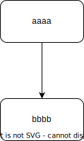

## Table of contents

- [Table of contents](#table-of-contents)
- [1. Introduction](#1-introduction)
- [2. L’écosystème Kubernetes](#2-lécosystème-kubernetes)
- [3. Architecture de Kubernetes](#3-architecture-de-kubernetes)

## 1. Introduction

Kubernetes, souvent abrégé en K8s, est un outil d'orchestration de conteneurs open source, initialement développé par Google. Il permet de gérer des applications conteneurisées, comme celles basées sur Docker, dans différents environnements de déploiement tels que des machines physiques, des machines virtuelles, le cloud ou des environnements hybrides. 

**Problèmes résolus par Kubernetes** :
Avec la transition des architectures monolithiques vers les microservices et l'usage accru des conteneurs, Kubernetes répond à la demande croissante d'une gestion efficace de centaines, voire de milliers de conteneurs. 

**Fonctionnalités clés de Kubernetes** :
- **Haute disponibilité** (hight availability) : garantit que les applications restent accessibles sans interruption.
- **Évolutivité** (Scalability or high performance) : permet d'ajuster rapidement la capacité de l'application en fonction de la demande.(scale your applications fast when you have more load on it ans more users are trying to access it and the same way you can easily scale it down when the load goes down)
- **Récupération** : assure des mécanismes de sauvegarde et de restauration des données en cas de problème infrastructurel.

## 2. L’écosystème Kubernetes

L'écosystème Kubernetes est constitué d'une variété de flavours qui implémentent les standards définis par Kubernetes, notamment pour les solutions réseau, le stockage, le loadbalancing, l'Ingress, l'autoscaling de clusters et le monitoring. Bien qu'il soit possible de créer un cluster Kubernetes personnalisé, cela demande une expertise technique et des choix complexes, ce qui pousse souvent les utilisateurs vers des solutions de fournisseurs de cloud, entraînant un vendor lock-in.

Voici quelques exemples d'écosystèmes Kubernetes populaires :
- **Google Kubernetes Engine (GKE)** : L’écosystème Kubernetes développé par Google. Très populaire car très flexible tout en étant l’implémentation de référence de Kubernetes.
- **Azure Kubernetes Services (AKS)** : Un écosystème Kubernetes axé sur l’intégration avec les services du cloud Azure (stockage, registry, réseau, monitoring, services de calcul, loadbalancing, bases de données…).
- **Elastic Kubernetes Services (EKS)** : Un écosystème Kubernetes assez standard à la sauce Amazon axé sur l’intégration avec le cloud Amazon (la gestion de l’accès, des loadbalancers ou du scaling notamment, le stockage avec Amazon EBS, etc.)
- **Rancher** : Un écosystème Kubernetes très complet, assez opinionated et entièrement open-source, non lié à un fournisseur de cloud. Inclut l’installation de stack de monitoring (Prometheus), de logging, de réseau mesh (Istio) via une interface web agréable. Rancher maintient aussi de nombreuses solutions open source, comme par exemple Longhorn pour le stockage distribué.
- **k3s** : Un écosystème Kubernetes fait par l’entreprise Rancher et axé sur la légèreté. Il remplace etcd par une base de données Postgres, utilise Traefik pour l’ingress et Klipper pour le loadbalancing.
- **Openshift** : Une version de Kubernetes configurée et optimisée par Red Hat pour être utilisée dans son écosystème. Tout est intégré donc plus guidé, avec l’inconvénient d’être un peu captif·ve de l’écosystème et des services vendus par Red Hat.
  

## 3. Architecture de Kubernetes

Kubernetes adopte une architecture master/worker, où un cluster Kubernetes est composé d'au moins un nœud maître (master node) et de plusieurs nœuds de travail (worker nodes), également appelés simplement "nœuds". Ces nœuds peuvent être des machines physiques ou virtuelles; vous interagirez rarement directement avec les nœuds.

- **Nœud maître** : il orchestre l'ensemble du cluster. Il gère la planification des applications, la distribution des ressources et assure la communication entre les nœuds de travail.
    Le “master” fait référence à un ensemble de processus gérant l’état du cluster. Le master peut également être répliqué pour la disponibilité et la redondance.
- **Nœuds de travail** : ce sont les machines sur lesquelles les conteneurs d'applications s'exécutent. Chaque nœud de travail est sous la supervision du nœud maître et héberge des pods qui contiennent les conteneurs.
  
Cette architecture permet une gestion flexible et évolutive des applications, avec une séparation claire des rôles entre la gestion du cluster (nœud maître) et l'exécution des tâches (nœuds de travail).

