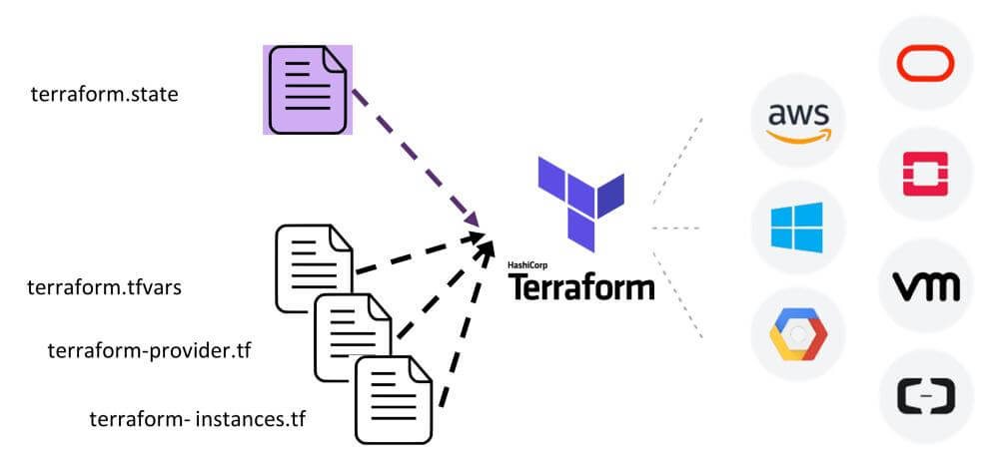

## Table of contents

- [Table of contents](#table-of-contents)
- [1. Introduction](#1-introduction)
- [2. Création de code Terraform](#2-création-de-code-terraform)
  - [2.1 Création du Provider (fournisseur)](#21-création-du-provider-fournisseur)
  - [2.2 Création de la Resource (ressource)](#22-création-de-la-resource-ressource)
  - [2.3 Création de notre instance ec2](#23-création-de-notre-instance-ec2)
  - [2.4 Les modifications de ressources](#24-les-modifications-de-ressources)
  - [2.5 Nettoyer votre infrastructure](#25-nettoyer-votre-infrastructure)
- [3. Les variables Input et Output](#3-les-variables-input-et-output)
- [4. Les provisioners et taints](#4-les-provisioners-et-taints)
- [4.1 Introduction](#41-introduction)
- [4.2 Les provisionneurs Terraform](#42-les-provisionneurs-terraform)
- [4.3 Ressources Taints](#43-ressources-taints)


## 1. Introduction
C'est un outil permettant de créer, modifier et versionner une infrastructure de manière sûre et efficace. Terraform peut gérer différents fournisseurs d'infrastructure, allant des Cloud Providers (AWS, Azure, GcP, Alibaba Cloud, etc ...) jusqu'aux solutions internes personnalisées (VmWare, Kubernetes, etc ...).



Vous codez vos fichiers de configuration qui décrivent à Terraform les composants nécessaires pour exécuter une seule ressource comme par exemple la création d'une machine virtuelle ou l'ensemble de votre datacenter. Ensuite, il générera plan d'exécution décrivant ce qu'il fera pour atteindre l'état que vous souhaitez, puis l'exécute pour construire l'infrastructure décrite. Au fur et à mesure que la configuration change, il sera en mesure de déterminer ce qui a changé et de créer des plans d'exécution incrémentiels qui peuvent être appliqués.

## 2. Création de code Terraform

Le code Terraform est écrit dans un langage appelé HCL dans des fichiers avec l'extension .tf. Il s'agit d'un langage déclaratif, qui est également utilisé par les langages de configuration dans d'autres applications, et en particulier par d'autres produits HashiCorp (créateur de Terraform). 

### 2.1 Création du Provider (fournisseur)

La première étape de l'utilisation de Terraform consiste généralement à configurer le ou les providers (fournisseurs) que vous souhaitez utiliser. Pour ce faire, créez un fichier avec l'extension .tf, dans mon cas je vais créer un fichier nommé main.tf. Ensuite, mettez-y le code suivant:


```tf
provider "aws" {
    region = "us-east-2"
    access_key = "votre-clé-dacces"
    secret_key = "votre-clé-secrète"
}
```

Cela indique à Terraform que vous allez utiliser le fournisseur AWS et que vous souhaitez déployer votre infrastructure dans la région "us-east-2". Vous devez également spécifier la paire de clés de votre utilisateur.

### 2.2 Création de la Resource (ressource)
Pour chaque fournisseur, il existe de nombreux types de ressources que vous pouvez créer, tels que des serveurs, des bases de données, des équilibreurs de charge, etc. Avant de déployer des ressources complexes, voyons d'abord comment déployer une instance de calcul (machine virtuelle) qui s'exécutera en répondant "Hello devopssec" à nos requêtes HTTP. Dans le jargon AWS, un serveur/machine virtuelle est appelé une instance EC2 . Ajoutez le code suivant à votre fichier main.tf


```tf
resource "aws_instance" "my_ec2_instance" {
    ami = "ami-07c1207a9d40bc3bd"
    instance_type = "t2.micro"
}
```

La syntaxe générale d'une ressource Terraform est la suivante :

```tf
resource "<FOURNISSEUR>_<TYPE>" "<NOM>" {
    [CONFIG …]
}
```

- FOURNISSEUR : c'est le nom d'un fournisseur (ici le provider "aws").
- TYPE : c'est le type de ressources à créer dans ce fournisseur (ici c'est une instance ec2)
- NOM : c'est un identifiant que vous pouvez utiliser dans le code Terraform pour faire référence à cette ressource (ici "my_ec2_instance")
- CONFIG : se compose de un ou plusieurs arguments spécifiques à cette ressource, dans notre cas :
  - ami : c'est l'acronyme d'"Amazon Machine Image" (AMI) , c'est donc l'image qui sera exécutée sur notre instance EC2. Vous pouvez trouver des AMI gratuites et payantes sur AWS Marketplace ou créer les vôtres directement depuis la console AWS ou à l'aide d'outils tels que Packer que nous aurons sûrement l'occasion d'utiliser dans de futurs chapitres. Dans notre cas, nous utilisons l'identifiant "ami-07c1207a9d40bc3bd" qui est une AMI Ubuntu 18.04 (Attention l'identifiant peut être modifié avec le temps !). Cette AMI est gratuite et éligible à l'offre gratuite d'AWS.
  - instance_type : Type d'instance EC2 à exécuter. Chaque type d'instance EC2 fournit une quantité différente de CPU, de mémoire, d'espace disque et de capacité réseau (plus d'informations ces différences sur cette page). Dans notre cas, nous utilisons le type t2.micro, qui fait partie du niveau gratuit AWS, et qui a comme caractéristiques 1 vCPU, ainsi que 1 Go de mémoire.

### 2.3 Création de notre instance ec2

En combinant les exemples précédents, nous nous retrouvons avec le code suivant :

```tf
provider "aws" {
    region = "us-east-2"
    access_key = "votre-clé-dacces"
    secret_key = "votre-clé-secrète"
}

resource "aws_instance" "my_ec2_instance" {
    ami = "ami-07c1207a9d40bc3bd"
    instance_type = "t2.micro"
}
```
Depuis un terminal, accédez au dossier dans lequel vous avez créé votre fichier main.tf et exécutez la commande suivante :

```bash
terraform init
```

Résultat :

```bash

Initializing the backend...

Initializing provider plugins...
- Checking for available provider plugins...
- Downloading plugin for provider "aws" (hashicorp/aws) 2.57.0...
...
...
Terraform has been successfully initialized!

```

Pour info le binaire terraform téléchargé dans le chapitre précédent, ne contient que les fonctionnalités de base nécessaires au fonctionnement de Terraform, ce qui fait qu'il n'est pas fourni avec le code d'aucun des fournisseurs. Donc lorsque vous commencez à utiliser Terraform, vous devez exécuter cette fameuse commande terraform init pour demander à Terraform de d'abord scanner votre code, qui déterminera quel fournisseur vous utilisez et téléchargera le code pour vous.

En effet, par défaut, le code du fournisseur sera téléchargé dans ce dossier .terraform qui est le répertoire de travail de Terraform (vous pouvez l'ajouter dans un fichier .gitignore). 

Maintenant que vous avez téléchargé le code du fournisseur, exécutez la commande suivante :

```bash
terraform plan
```

Résultat :

```bash

Refreshing Terraform state in-memory prior to plan...
...
Resource actions are indicated with the following symbols:
  + create

Terraform will perform the following actions:

  # aws_instance.my_ec2_instance will be created
  + resource "aws_instance" "my_ec2_instance" {
      + ami                          = "ami-07c1207a9d40bc3bd"
      +  ...
      +  ...
    }

Plan: 1 to add, 0 to change, 0 to destroy.
"terraform apply" is subsequently run
```
La commande plan est utilisée pour créer un plan d'exécution. Elle détermine les actions nécessaires pour atteindre l'état souhaité, spécifié dans les fichiers de configuration sans les exécuter. Elle n'est pas obligatoire mais ça reste un excellent moyen de vérifier vos modifications avant de les diffuser. La sortie de la commande plan ressemble un peu à la sortie de la commande Linux diff, avec le signe + qui indique les ressources qui vont être créées, le signe - pour les ressources qui vont être supprimées et enfin le signe ~ pour les ressources qui vont être modifiées.

Maintenant, pour véritablement créer notre ressource Terraform, exécutez la commande suivante :

```bash
terraform apply
```
Résultat :


```bash
Do you want to perform these actions?
  Terraform will perform the actions described above.
  Only 'yes' will be accepted to approve.

  Enter a value: yes

aws_instance.my_ec2_instance: Creating...
aws_instance.my_ec2_instance: Still creating... [10s elapsed]
aws_instance.my_ec2_instance: Still creating... [20s elapsed]
aws_instance.my_ec2_instance: Still creating... [30s elapsed]
aws_instance.my_ec2_instance: Creation complete after 39s [id=i-0f6d6ee734f745e22]

```
Vous remarquerez que la commande apply vous affiche la même sortie que la commande plan et vous demande de confirmer, si vous souhaitez réellement poursuivre avec ce plan, alors tapez "yes" et appuyez sur Entrée pour déployer votre instance EC2.


### 2.4 Les modifications de ressources

Terraform garde une trace de toutes les ressources qu'il a déjà créées. Si on rajoute par exemple une information Terraform saura détecter que votre instance EC2 existe déjà, et vous montrera la différence entre ce qui est actuellement déployé et ce qu'il y a actuellement dans votre code Terraform. 

### 2.5 Nettoyer votre infrastructure
Lorsque vous avez terminé vos expériences avec Terraform, vous pouvez supprimer toutes les ressources que vous avez créées afin qu'AWS ne vous les facture pas (ne vous inquiétez les services utilisés dans cet article sont gratuits dans l'offre gratuite d'AWS). Puisque Terraform garde une trace des ressources que vous avez créées, le nettoyage reste simple. Il vous suffit d'exécuter la commande suivante :


```bash
terraform destroy
```
Une fois que vous avez tapé "yes" et appuyé sur "Entrée", Terraform vous affichera les ressources à détruire et supprimera toutes les ressources dans le bon ordre.


## 3. Les variables Input et Output


## 4. Les provisioners et taints
## 4.1 Introduction
Terraform nous aide non seulement à créer et à gérer les infrastructures, mais également à les approvisionner lors de la création ou de la suppression de ressources.

Pour cela, il utilise une fonctionnalité nommée provisioner, Les provisionneurs sont utilisés pour exécuter des scripts ou des commandes shell sur une machine locale ou distante dans le cadre de la création/suppression de ressources

## 4.2 Les provisionneurs Terraform
## 4.3 Ressources Taints


# REF

https://devopssec.fr/article/provisioners-taints-terraform#begin-article-section
